# SNN-NEAT-GPU

**A from-scratch C++ / OpenCL spiking neural network that predicts mouse position and clicks. Topology and AdEx dynamics are searched with NEAT. Backpropagation is done in small scale and while the model is live and running on the machine, no tensor library.**

<p align="center">
  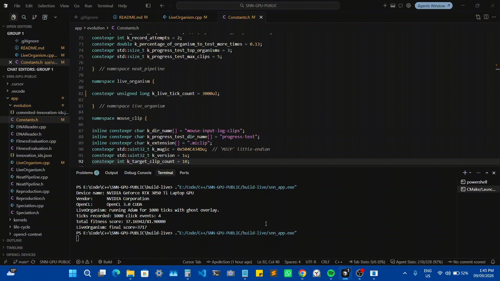
</p>

<p align="center"><em>Live inference: predicted ghost cursor [BLUE CIRCLE OVERLAY] against the real pointer.</em></p>

## Why this exists

Hand-rolling GPU kernels for a spiking net is unusual for a reason. Spike timing, axonal delay, and local plasticity are event-driven and sparse. Flattening that into a dense layer stack throws away the thing that makes an SNN an SNN.

This repo is the full stack: a work-efficient OpenCL simulator, sparse graph layouts, neuroevolution as the search algorithm, live input capture, crash-safe checkpoints, and a visualizer for genomes that do not fit in a log line.

The interesting engineering problem is the combination: preserve temporal structure on a SIMT device while searching a discontinuous space of topologies *and* neuron parameters.

## Architecture

`Mouse input → spike encoding → AdEx update → spike compaction → reward-modulated STDP → delayed propagation → output decode → fitness → NEAT`

- **Neuron model:** Adaptive Exponential Integrate-and-Fire, refractory period, firing-rate traces, homeostatic regularization
- **Sparse layout:** CSR for fan-out (propagation), CSC for fan-in (STDP / homeostasis), bit-packed dirty flags, circular delay buffers
- **Online learning:** reward-modulated STDP during evaluation, not a separate backward pass
- **Search:** NEAT structural mutation, innovation tracking, tournament selection, elitism, stagnation, adaptive speciation
- **Evaluation:** one shared recorded clip per generation for comparable selection; a held-out progress test for generalization

### AdEx

Hidden and output units are AdEx cells. Membrane voltage leaks toward rest, has an exponential spike-onset term near threshold, and is opposed by a slower adaptation current `w`. A spike resets `V`, increments `w`, and enters refractory.

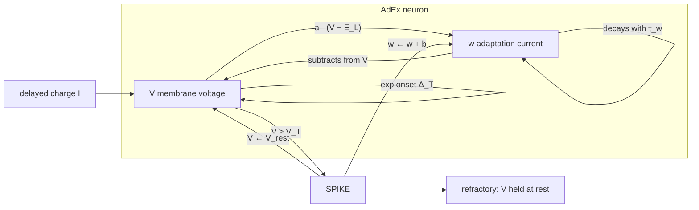

```
C  dV/dt  =  −g_L (V − E_L)  +  g_L Δ_T exp((V − V_peak) / Δ_T)  −  w  +  I
τ_w dw/dt =  a (V − E_L)  −  w

if V ≥ V_T:
    V ← V_rest ,  w ← w + b ,  enter refractory
```

Global constants (`C`, `g_L`, `E_L`, `Δ_T`, `V_peak`) live on the genome. Per-neuron parameters (`a`, `b`, `τ_w`, `V_T`, `V_rest`, refractory length) mutate independently. Integration is event-driven: only neurons marked dirty by incoming delayed charge run AdEx, and they catch up every skipped tick since last write. That is occupancy-aware sparse update, not a dense `N` sweep every frame.

### Kernel pipeline

One simulation tick is six kernels. The pipeline stays work-efficient: AdEx follows dirty bits, STDP and propagation follow a compacted spike list, delays live in a ring buffer.

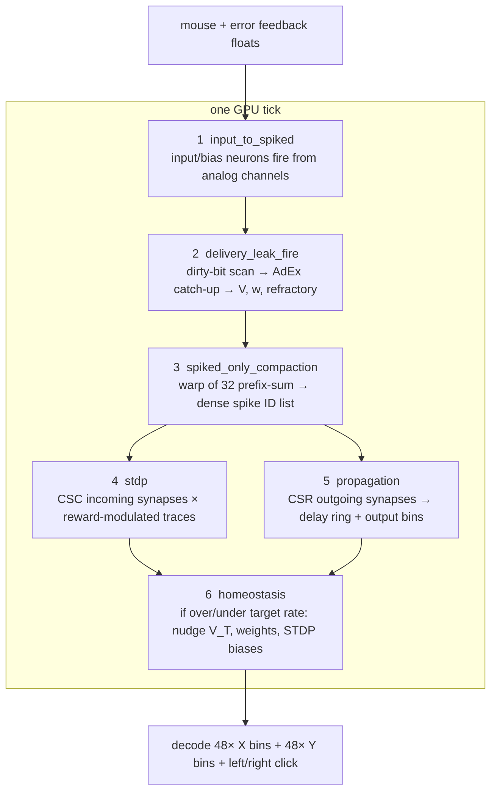

```
 spike IDs ──CSR──►  delay ring [(tick + delay) % max_delay]
                         │
                         ▼
              charge[slot * N + neuron]   dirty bits N/32
                         │
                         ▼
              only dirty neurons run AdEx

 spike IDs ──CSC──►  STDP Δw = reward × (pot·trace − dep·(1−trace))
```

CSR answers "where does this spike go." CSC answers "which incoming synapses get credit." Stream compaction (warp-level prefix sum over 32 lanes) turns a sparse boolean spike vector into a dense ID list so later kernels do not scan `N`. The delay ring makes axonal delay a first-class genome parameter instead of fake layer depth.

### Speciation on phenotype, not genotype

Canonical NEAT compatibility uses excess/disjoint genes and weight distance — genomic topology. That is the wrong metric for this task. Two unrelated graphs can produce the same cursor trajectory (phenotypic convergence). Two isomorphic graphs can disagree on click type (same genotype, different policy).

Compatibility is therefore a **behavior distance** on the shared generation clip, the analog of clustering on rollout traces rather than on parameter vectors. Every 25 ticks the engine logs predicted `(x, y)` and left/right click rates. Distance is `0.7` position + `0.3` click, already normalized to `[0, 1]`. Below an adaptive threshold (starts at 15%) they are the same species.

Selection pressure stays on the policy. Genomic distance would protect structural novelty that does not change the mouse. Behavioral niching also remains well-defined as genomes grow, which genomic distance does not.

## Seeds: Adam, Eve, Abel

The search is not started from a single inductive bias. Three hand-built seeds in `DNAs/` share the same I/O layout and differ in initial complexity — a controlled ablation on starting topology.

| Seed | Role | Hidden | Synapses | Species id | Species lifetime |
| --- | --- | ---: | ---: | ---: | --- |
| **Adam** | Minimal | 0 | 2 | 0 | Gens 0–73, longest of the three |
| **Abel** | Middle | 0 | 6 | 2 | Gens 0–45, then speciated away |
| **Eve** | Complex | 5 | 65 | 1 | Never formed a stable species |

Earlier runs failed in both directions: a single minimal genome had no expressivity; a single dense genome occupied a rugged local basin that mutation could not leave. A complexity ladder is the compromise: add structure where the fitness landscape rewards it, drop it where it does not.

**Adam's species survived longest because the genome was mutation-robust, not because the policy was strong.** Two synapses. Most mutations are phenotypically silent, so offspring stay inside the behavior-distance threshold and remain in species 0. The cluster stayed large for 73 generations: high heritability of behavior, low speciation rate, slow extinction.

That same robustness is a capacity limit. The policy could not climb. Held-out score stalled near **3,934**. By generation 73 the species had **zero offspring** after 47 stagnant generations — a diversity-preserving niche that selection eventually starved.

Abel is the opposite failure mode of success. Six connections were enough for descendants to leave the phenotypic neighborhood, cross the compatibility threshold, and split into new species ids. Species 2 died around generation 45 while Abel-like wiring continued under new ids. Eve's five hidden units and 65 synapses produced noisy traces and a large mutation neighborhood; it never established species 1. Premature complexity, no foothold.

<p align="center">
  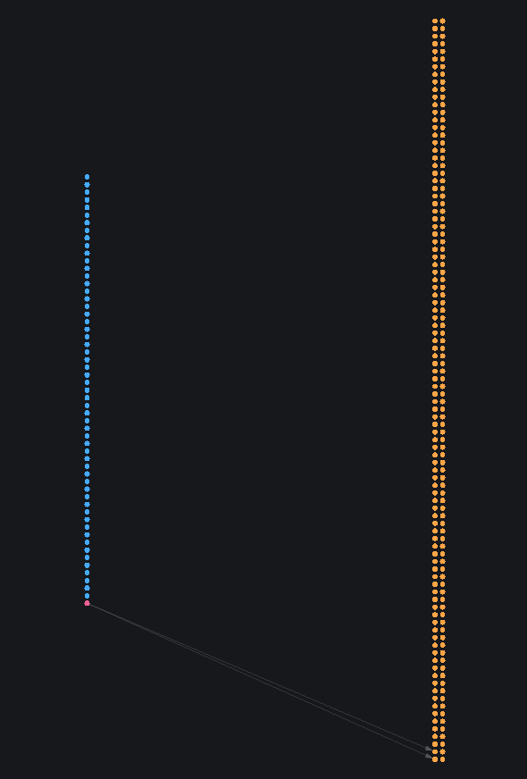
  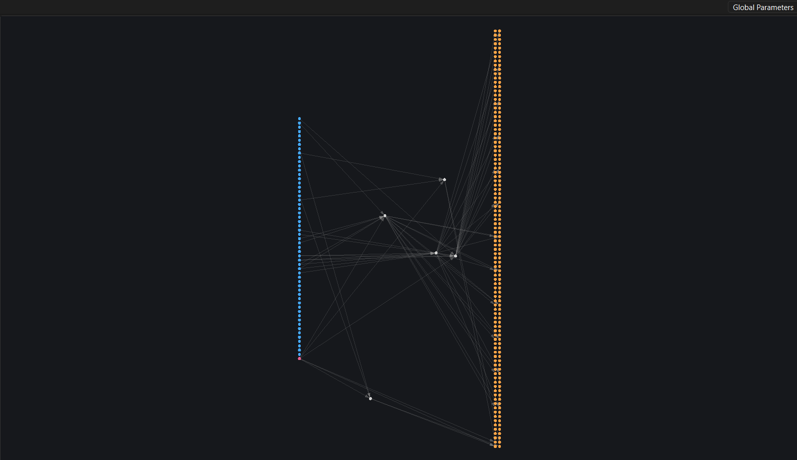
  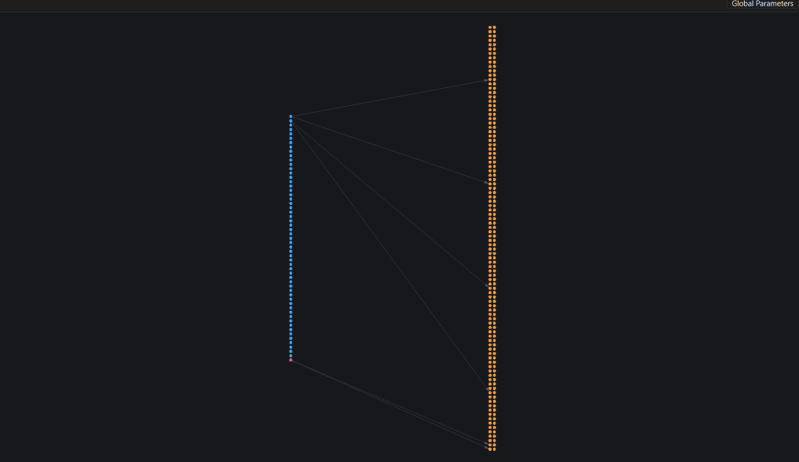
</p>

<p align="center"><em>Adam, Eve, Abel</em></p>

## Results

Latest run: **677 generations**, population **150**, **6** active species. Best raw fitness **5,020**. Best held-out progress-test score at generation 671: **3,738**. About **0.23 ms per tick** on the development machine. These are internal optimization scores, not an external benchmark.

Training moved. Then it plateaued. Better seeds, per-parameter mutation scales, corrected speciation, and a cleaner fitness signal cleared the early dead ends. Later generations still converged on a partial policy. A leading species at generation 671 reached ~**95.6% left-click hits and 0% right-click hits** — mode collapse on click type, not a solved predictor.

### Species representatives

The graphs are species representatives, not named organisms. Each species stores a **rep** (`species/<id>-rep.json`): the generation champion, used as the phenotypic centroid for compatibility. A **legend** (`species/<id>-legend.json`) stores the member with the best held-out score. Live inference loads the legend of species 1288.

**Species 1288** appeared at generation **334** and remained dominant for ~**240** generations. Its representative is the stronger of the two: ~**95.5%** left-click hits, progress test **4,112**, best raw near **4,960**. Right-click still **0%**. Best cursor-pursuit genome in the run. Incomplete click classifier.

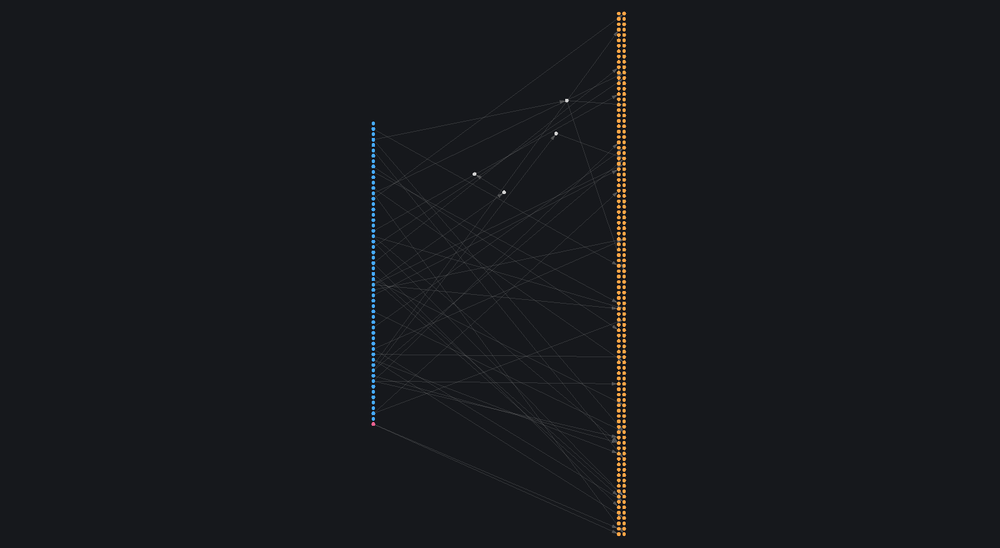

**Species 1858** is the latest leading species (created generation **571**, still present at **677**). Its representative is weaker on the held-out set (**3,638** vs 1288's **4,112**) even though this species posted the run's highest in-sample clip fitness (**5,020**). That gap is the generalization gap: a lucky training clip is not a better estimator. Right-click remains **0%**.

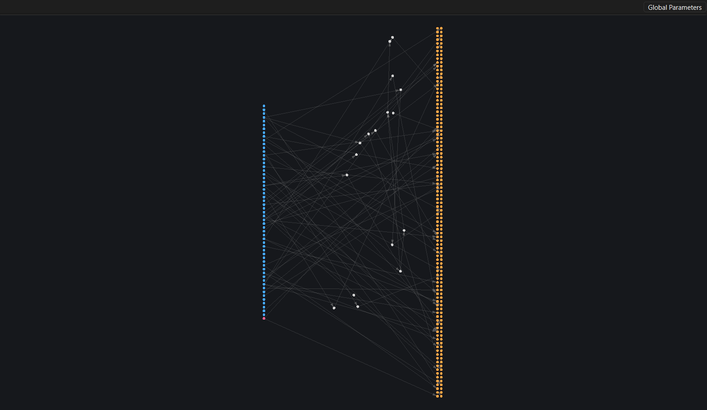

### Progress test vs generation clip

Every generation, the full population of 150 replays **one shared recorded clip** (~2,813 ticks, ~45 seconds). That is a paired comparison: identical stimulus, comparable fitness, valid for *that* generation's ranking. The next generation samples a different clip, so the series is not a learning curve. Clip difficulty is a confounder. An easy draw inflates everyone; a hard draw tanks everyone. Treating it as progress would be reading noise as signal.

The **progress test** exists because in-sample fitness is not an unbiased estimator. After each generation the top **3** organisms per species are re-evaluated on a **fixed held-out set** of up to **5** clips in `mouse-input-log-clips/progress-test/`. Mean score is the generalization metric. Stagnation, legend replacement, and whether the population improved are gated on this split — the analog of a locked validation set, not the training batch.

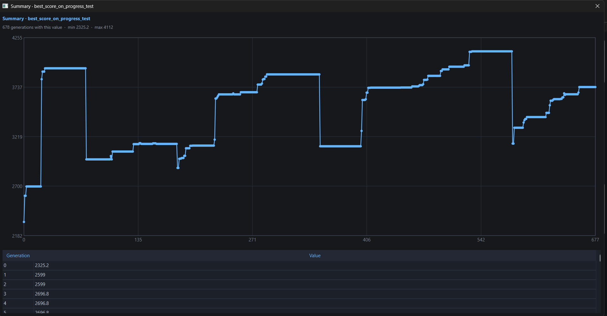

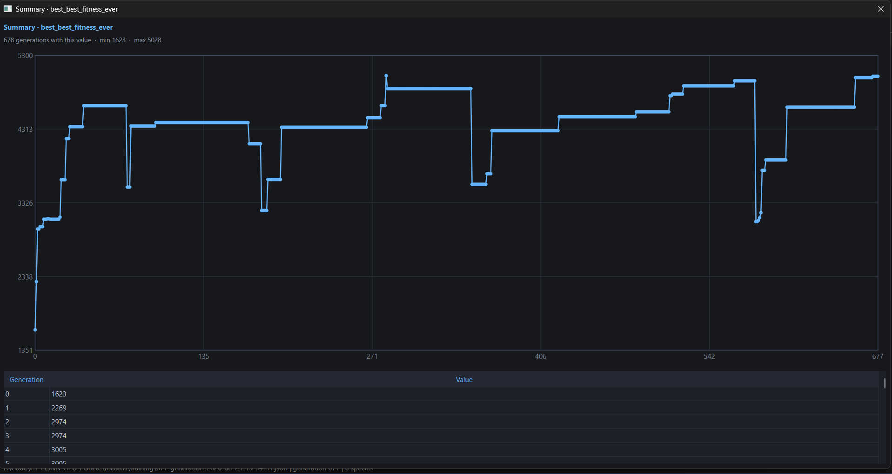

Read them as a pair. The clip timeline is high-variance by construction (distribution shift every generation). The progress-test timeline is the one that answers generalization.

### Prediction error

Prediction error is the **highest-weight fitness term** (24, versus 14 for each click-type hit). On every physical click it measures how close the predicted cursor stayed to that click location over the ticks since the previous click — a squared-closeness complement of RMS distance, in `[0, 1]`, minimized.

Without it, the search reward-hacks: classify the button, ignore localization, or snap to the target only on the click frame. Early hovering is the actual temporal credit-assignment problem. The same error is packed back into the next tick as the STDP reward signal, so local plasticity and global fitness are aligned on one objective.

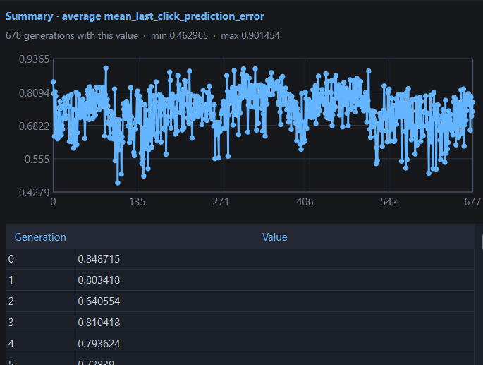

### Left-click hits vs right-click hits

A **hit** is a physical click whose next-click *type* was predicted correctly: the decoded `left_click` logit outvoted `right_click`, or the reverse.

They are tracked separately because they are separate output heads, separate fitness terms, and — in this run — separate evolutionary outcomes. Aggregating them into one "click accuracy" would hide class-conditional collapse.

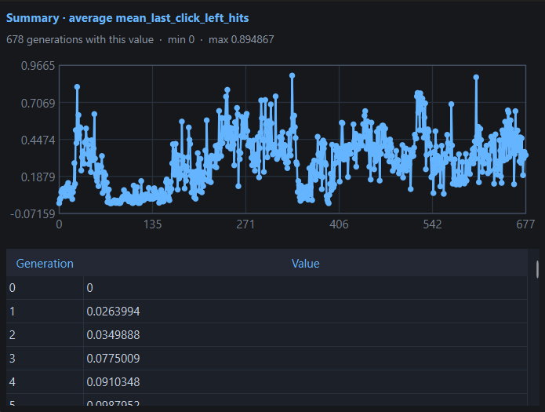

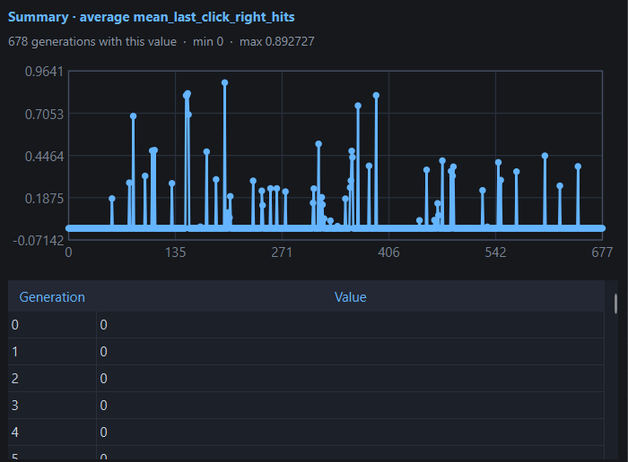

Left-click hits saturated. Right-click hits stayed at **0%**. Always preferring left is a stable local optimum under class imbalance (clips often contain more left clicks) and because the two heads do not share credit. Independent metrics make that failure visible.

## Visualizer

`debug/Visualizer.py` exists because scalar fitness is not an observability story. Genomes are thousands of JSON fields. Training state is a high-dimensional time series. A dead synapse, a species that collapsed to one policy, an AdEx cell whose parameters drifted out of the operating regime — none of that appears in a score.

It is the debugging and depth-analysis surface:

- inspect neuron and synapse parameters on click
- pan/zoom topology, hide isolated nodes
- hot-reload DNA when the file changes on disk
- watch `species/` as checkpoints appear during training
- plot world-manager metrics across generations

```powershell
python -m pip install PySide6
python debug/Visualizer.py species/1288-legend.json
```

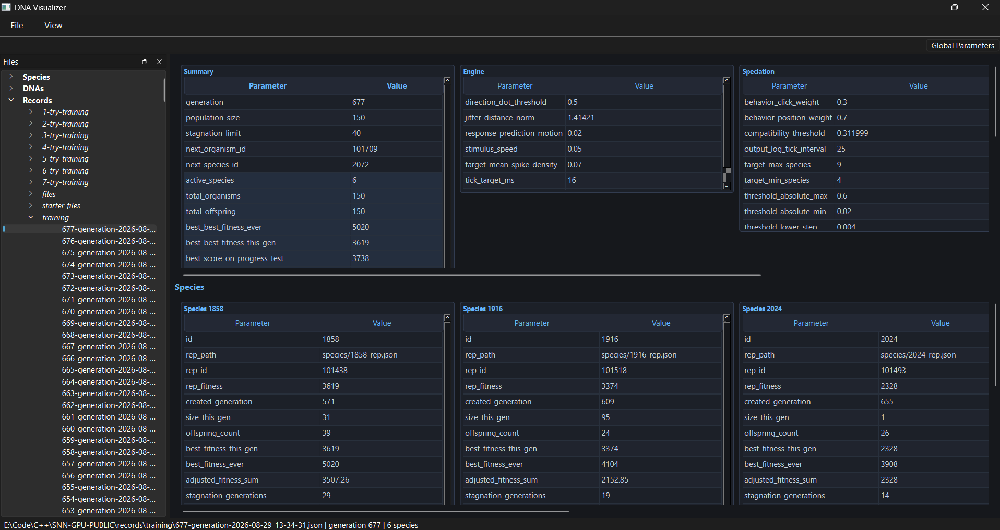

## Data formats

### DNA as JSON

Genomes are versionable JSON (`global_genome`, `neuron_genomes`, `connection_genomes`). Seeds live in `DNAs/`, the living population in `species/`. JSON is a deliberate choice: human-readable, diffable, patchable, and loadable in the visualizer with no custom decoder. Archived seeds and world-state: `records/starter-files/`.

### Mouse clips (`.miclip`)

Input is recorded as a little-endian binary log in `mouse-input-log-clips/` (`MICP` magic, version 1). Header, then a tightly packed `HostMouseInput` POD per tick — replay-stable, trivially copyable, no serialization tax on the hot path.

**Header**

| Field | Type | Meaning |
| --- | --- | --- |
| `magic` | `uint32` | `0x504C434D` (`MICP`) |
| `version` | `uint32` | format version (`1`) |
| `struct_size` | `uint32` | `sizeof(HostMouseInput)` |
| `tick_count` | `uint64` | samples that follow |

**Each sample (`HostMouseInput`)**

| Field | Type | Meaning |
| --- | --- | --- |
| `x_norm` | `float` | cursor X in `[0, 1]` of the monitor |
| `y_norm` | `float` | cursor Y in `[0, 1]` |
| `scroll_mouse_up` | `float` | scroll-up events this tick |
| `scroll_mouse_down` | `float` | scroll-down events this tick |
| `left_mouse_clicked` | `float` | left button held |
| `right_mouse_clicked` | `float` | right button held |
| `scroll_mouse_clicked` | `float` | middle / scroll click |
| `left_click_edge` | `float` | left pressed this tick |
| `right_click_edge` | `float` | right pressed this tick |

Held-out progress-test clips use the same format in `mouse-input-log-clips/progress-test/`.

## Development history

- **Days 1–3:** Initial simulator and NEAT. Early stagnation traced to over-parameterized seeds, incorrect dynamic-speciation math, and mutation-distribution bugs
- **Days 4–7:** Per-parameter mutation scales, firing-rate decay fix, stable species count, population 70 → 150, elitism and stagnation reworked
- **Days 8–12:** Uncapped scores, richer logs, atomic recoverable saves, kernel-program reuse, lower per-organism setup. Throughput improved; the run still plateaued after 370 generations
- **Days 13–18:** Minimal structured topologies, smaller output encoding, higher stagnation patience, single time-aware squared prediction error instead of competing objectives
- **Days 19–23:** Removed uneven retesting. Phenotypic speciation, locked progress-test clips, Adam / Abel / Eve seeds. Early gains, then another plateau by generation 677

## Limitations

- The evolved policy is not a reliable general mouse predictor. Click-type collapse and long fitness plateaus remain
- Next ablations: neuron-to-synapse density, species stagnation horizon, behavior-distance threshold
- Fitness still supplies delayed, indirect credit on a temporal SNN task. Novelty search or curriculum could improve credit assignment
- GPU occupancy and host/device synchronization have not been profiled across hardware
- Build and input capture target Windows; portability is unfinished

## Run locally

### Requirements

- Windows with an OpenCL SDK/runtime and a GPU or CPU OpenCL device
- CMake 3.25+, C++20 MinGW toolchain, GLFW 3
- Network access on first configure (`nlohmann/json`)

### Live inference

Loads the legend of species 1288 and draws predicted position as a ghost cursor:

```powershell
cmake --preset live
cmake --build --preset live
.\build-live\snn_app.exe
```

### Training

Records and replays clips, evaluates the population, updates species, writes recoverable generation state:

```powershell
cmake --preset train
cmake --build --preset train
.\build-train\snn_app.exe
```

Seed DNA JSON belongs in `DNAs/`. Archived seeds and world-state: `records/starter-files/`.

## Stack

C++20 · OpenCL · CMake · GLFW · nlohmann/json · Python · PySide6

## License

MIT
