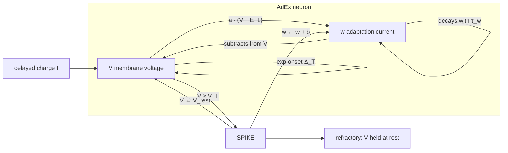
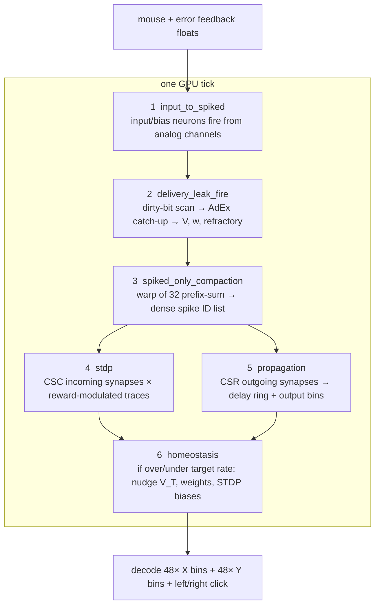

# SNN-NEAT-GPU

**A spiking neural network built from scratch in C++ and OpenCL that learns to predict mouse position and clicks, with both its topology and neuron dynamics evolved through NEAT instead of backpropagation**

<p align="center">
  
</p>

<p align="center"><em>Best-performing organism: ghost cursor vs real mouse during live inference</em></p>

## Why this project

Most neural-network projects rely on established tensor libraries; this one contains the complete simulation and learning pipeline as sparse OpenCL kernels. The challenge is twofold: preserve spike timing, delayed transmission, and local plasticity efficiently on a GPU while searching a large, discontinuous space of network structures and biologically inspired parameters.

The result is an end-to-end neuroevolution system covering GPU compute, sparse data structures, evolutionary algorithms, real-time input capture, fault-tolerant training state, and custom visualization.

## System architecture

`Mouse input → spike encoding → AdEx neuron update → spike compaction → reward-modulated STDP → delayed propagation → output decoding → fitness → NEAT reproduction`

- **Simulation core:** Adaptive Exponential Integrate-and-Fire neurons, refractory periods, firing-rate traces, and homeostatic regulation
- **Sparse GPU pipeline:** CSR adjacency for outgoing propagation, CSC adjacency for incoming STDP updates, packed dirty bits, and circular buffers for per-synapse delays
- **Learning:** reward-modulated spike-timing-dependent plasticity updates weights during each evaluation
- **Evolution:** NEAT-style structural and parameter mutation, innovation tracking, tournament selection, elitism, stagnation handling, and adaptive speciation
- **Evaluation:** every organism replays the same recorded mouse-input clip; separate progress-test clips measure generalization

### AdEx membrane

Each hidden and output neuron is an Adaptive Exponential Integrate-and-Fire cell. Voltage `V` leaks toward rest, explodes exponentially near threshold, and is pulled down by a slower adaptation current `w`. A spike resets `V`, jumps `w`, and locks the cell in refractory.



```
C  dV/dt  =  −g_L (V − E_L)  +  g_L Δ_T exp((V − V_peak) / Δ_T)  −  w  +  I
τ_w dw/dt =  a (V − E_L)  −  w

if V ≥ V_T:
    V ← V_rest ,  w ← w + b ,  enter refractory
```

`C`, `g_L`, `E_L`, `Δ_T`, and `V_peak` are genome globals. `a`, `b`, `τ_w`, `V_T`, `V_rest`, and refractory length mutate per neuron. On the GPU, AdEx only runs for neurons marked dirty by incoming delayed charge, and it catch-up integrates every missed tick since that cell last updated.

### GPU kernels

One simulation tick is six OpenCL stages. Work stays sparse: AdEx follows dirty bits, STDP and propagation follow the compacted spike list, and delays live in a circular ring.



```
 spike IDs ──CSR──►  delay ring [(tick + delay) % max_delay]
                         │
                         ▼
              charge[slot * N + neuron]   dirty bits N/32
                         │
                         ▼
              only dirty neurons run AdEx

 spike IDs ──CSC──►  STDP Δw = reward × (pot·trace − dep·(1−trace))
```

CSR walks outgoing synapses after a spike. CSC walks incoming synapses for plasticity and homeostasis. The delay ring is why timing is a first-class genome parameter instead of a discrete layer depth.

### Species by behavior, not genome shape

Classic NEAT clusters organisms by excess/disjoint genes and weight distance. That failed here: two networks can look unrelated on paper and still park the ghost cursor in the same place, or share a topology and click completely differently.

Compatibility is therefore a **behavior distance** on the shared generation clip. Every `25` ticks the engine logs predicted `(x, y)` plus left/right click rates. Distance is `0.7` position + `0.3` click, already normalized to `[0, 1]`. Organisms whose traces differ by less than the adaptive threshold (starts at `15%`) are the same species.

That keeps selection pressure on *what the network does*, which is the only signal that matters for a mouse predictor, and it lets speciation stay stable while genomes grow.

## Seeds: Adam, Eve, and Abel

Training starts from three hand-built genomes in `DNAs/` so evolution is not betting on a single topology. All three share the same input/output layout; they differ in how much hidden structure they already have.

| Seed | Role | Hidden neurons | Synapses | Species id | How long that species lived |
| --- | --- | ---: | ---: | ---: | --- |
| **Adam** | Minimal | 0 | 2 | 0 | Generations 0–73, the longest of the three |
| **Abel** | Middle | 0 | 6 | 2 | Generations 0–45, then split into new species |
| **Eve** | Complex | 5 | 65 | 1 | Never established a stable species |

Three seeds exist because earlier runs died in opposite ways: a single tiny genome could not invent useful paths, and a single rich genome locked the search into an unmutable blob. Seeding a complexity ladder lets mutation add structure where it helps and abandon it where it does not.

**Adam lasted longest because it was simple, not because it was better.** Two synapses leave almost no room for a mutation to change cursor behavior. Under behavioral speciation, offspring that still move the ghost cursor like their parent stay in the same species, so species 0 stayed large and cohesive for 73 generations. It was a stable niche: hard to break, easy to copy, slow to empty.

That same simplicity capped it. Adam could not grow a richer strategy, its progress-test score stuck near **3,934**, and by generation 73 it was assigned **zero offspring** after 47 stagnant generations. Survival was robustness, not discovery.

Abel went the other way. Six connections were enough for descendants to *act* differently, so they crossed the compatibility threshold and left species 2. The species id died around generation 45 even though Abel-style wiring kept evolving under new ids. Eve's five hidden cells and 65 synapses made traces noisy and the mutation neighborhood huge, so that seed never formed species 1 at all.

<p align="center">
  
  
  
</p>

<p align="center"><em>Adam (left), Eve (center), Abel (right)</em></p>

## Results

The latest training run reached **677 generations** with a population of **150** and maintained **6 active species**. The recorded best raw fitness was **5,020**; at generation 671, the best held-out progress-test score was **3,738**, while species logs reported approximately **0.23 ms per simulation tick** on the development machine. Fitness values are internal optimization scores, not external benchmark results.

Progress was real but ultimately plateaued. Minimal starting topologies, better-scaled mutations, corrected speciation, and revised fitness signals moved training beyond the early dead ends; however, later generations still converged on incomplete strategies. For example, a leading generation-671 species achieved roughly **95.6% left-click hits but 0% right-click hits**, exposing behavioral collapse rather than a solved predictor.

### Species representatives: 1288 and 1858

These graphs are not named organisms. Each species keeps a **representative**: the current generation's fittest member of that species (`species/<id>-rep.json`). A separate **legend** (`species/<id>-legend.json`) stores the member that generalized best on the progress test. Live inference loads the legend of species 1288.

**Species 1288** appeared at generation **334** and stayed dominant for roughly **240 generations**. Its representative is the stronger of the two graphs below: about **95.5% left-click hits**, a progress-test score of **4,112**, and a best raw fitness near **4,960** — still **0% right-click hits**. That representative is the best cursor-pursuit genome the run produced, not a complete click predictor.


**Species 1858** is the latest leading species, created at generation **571** and still present at generation **677**. Its representative (`docs/organism-1858.png`) scores lower on the held-out progress test (**3,638** vs 1288's **4,112**) even though this species briefly posted the run's highest raw clip fitness (**5,020**). That gap is the clip lottery: a lucky generation clip is not the same as a better predictor. Right-click hits remain **0%**.


### Progress test vs generation clip

Every generation, all 150 organisms replay **one shared recorded clip** (~2,813 ticks, ~45 seconds). That clip is the fair contest for that generation: same mouse path, same clicks, comparable fitness. The next generation draws a different clip, so those scores are **not** a timeline of true skill. A lucky easy clip inflates everyone; a hard clip punishes everyone.

The **progress test** exists because selection must not trust that lottery. After each generation the top **3** organisms of every species are re-scored on a **fixed held-out set** of up to **5** clips in `mouse-input-log-clips/progress-test/`. The mean of those clips is the generalization score. **Species stagnation, legend replacement, and “did we actually get better?” are decided here**, not on the generation clip.


Read the two graphs together: the clip timeline is noisy by design; the progress-test timeline is the one that answers whether the population generalized.

### Click-prediction error

Prediction error is the **largest fitness term** (weight `24`, ahead of click-type hits at `14` each). For every physical click it measures how close the ghost cursor stayed to that click location across the ticks since the previous click — a squared-closeness complement of RMS distance, in `[0, 1]`, lower better.

That term exists so evolution cannot game the task by guessing the button while ignoring *where* to click, or by arriving only on the click frame. Hovering on the target early is what a real predictor must do, and it is also the error signal packed back into the next tick for reward-modulated STDP.


### Left-click hits vs right-click hits

A **hit** is a physical click whose next-click *type* was predicted correctly: the decoded `left_click` logit outvoted `right_click`, or the reverse. They are separate metrics because they are separate output slots, separate fitness terms, and — in this run — separate evolutionary fates.


Left-click hits climbed toward saturation. Right-click hits stayed at **0%**. Always preferring left is a stable local optimum on clips that contain more left clicks, and the two buttons do not share credit. That split is why both graphs are required: a single “click accuracy” number would hide the collapse.

## Visualizer

The PySide6 visualizer in `debug/Visualizer.py` is the debugging surface for genomes that are thousands of JSON fields and for training logs that are high-dimensional time series. Console fitness alone cannot show a silent synapse, a species that collapsed to one behavior, or a neuron whose AdEx parameters drifted into a dead regime.

It was built for **debugging and depth analysis**:

- click any neuron or connection to read live parameters
- pan/zoom the topology; hide isolated nodes
- auto-reload when a DNA file changes on disk
- browse `species/` as files appear during training
- double-click world-manager fields to plot a metric across generations

```powershell
python -m pip install PySide6
python debug/Visualizer.py species/1288-legend.json
```


## Data formats

### DNA as JSON

Every genome is a readable JSON file (`global_genome`, `neuron_genomes`, `connection_genomes`) under `DNAs/` for seeds and `species/` for the living population. JSON is intentional: genomes can be diffed, patched, and opened in the visualizer without a binary decoder. Archived seeds and matching world-state files live under `records/starter-files/`.

### Mouse-input clips (`.miclip`)

Training records and replays mouse motion as little-endian binary clips in `mouse-input-log-clips/` (`MICP` magic, version 1). Each file is a header plus a tightly packed array of the `HostMouseInput` POD, one sample per simulation tick.

**File header**

| Field | Type | What it is |
| --- | --- | --- |
| `magic` | `uint32` | `0x504C434D` (`MICP`) |
| `version` | `uint32` | format version (`1`) |
| `struct_size` | `uint32` | `sizeof(HostMouseInput)` |
| `tick_count` | `uint64` | number of samples that follow |

**Each sample (`HostMouseInput`)**

| Field | Type | What it is |
| --- | --- | --- |
| `x_norm` | `float` | cursor X in `[0, 1]` of the monitor |
| `y_norm` | `float` | cursor Y in `[0, 1]` |
| `scroll_mouse_up` | `float` | scroll-up events this tick |
| `scroll_mouse_down` | `float` | scroll-down events this tick |
| `left_mouse_clicked` | `float` | left button held |
| `right_mouse_clicked` | `float` | right button held |
| `scroll_mouse_clicked` | `float` | middle / scroll click |
| `left_click_edge` | `float` | left button pressed this tick |
| `right_click_edge` | `float` | right button pressed this tick |

Held-out progress-test clips use the same format in `mouse-input-log-clips/progress-test/`.

## Development history

- **Foundation (days 1–3):** Built the initial simulator and NEAT pipeline, then traced early stagnation to over-complex seed genomes, incorrect dynamic-speciation math, and mutation-distribution bugs
- **Evolution stability (days 4–7):** Introduced parameter-specific mutation scales, corrected firing-rate decay, stabilized the species count, raised the population from 70 to 150, and reworked elitism and stagnation safeguards
- **Observability and speed (days 8–12):** Removed scoring caps, expanded generation/species logs, made saves recoverable, reused compiled kernels, and reduced per-organism setup overhead; the faster run still plateaued after 370 generations
- **Search-space redesign (days 13–18):** Started from minimal structured topologies, reduced output encoding size, increased stagnation patience, and replaced competing anticipation/location objectives with one time-aware squared prediction error
- **Generalization and diversity (days 19–23):** Removed uneven retesting, switched from genotypic to behavioral speciation, added fixed progress-test clips, and seeded three complexity levels (Adam, Abel, and Eve). Training improved early, then stalled again by generation 677

## Limitations and future work

- The evolved policy did not become a reliable general mouse predictor; click-side collapse and long fitness plateaus remain
- The next investigation should isolate the effect of neuron-to-synapse density, species stagnation limits, and behavior-distance thresholds
- Fitness still provides delayed, indirect credit for a temporal SNN task; richer novelty or curriculum signals may improve credit assignment
- GPU occupancy and host/device synchronization have not been profiled systematically across hardware
- The current build and input-capture path target Windows; portability work is still needed

## Run locally

### Requirements

- Windows with a working OpenCL SDK/runtime and a GPU or CPU OpenCL device
- CMake 3.25+, a C++20 MinGW toolchain, and GLFW 3
- Internet access during the first configure step to fetch `nlohmann/json`

### Live inference

The live preset loads the checked-in champion genome (`species/1288-legend.json`) and displays its predicted position as a ghost cursor:

```powershell
cmake --preset live
cmake --build --preset live
.\build-live\snn_app.exe
```

### Training

Training continuously records/replays mouse-input clips, evaluates the population, updates species, and writes recoverable generation state:

```powershell
cmake --preset train
cmake --build --preset train
.\build-train\snn_app.exe
```

Training expects seed genome JSON files in `DNAs/`. Archived seed genomes and matching world-state files are available under `records/starter-files/`.

## Tech stack

C++20 · OpenCL · CMake · GLFW · nlohmann/json · Python · PySide6

## License

MIT
